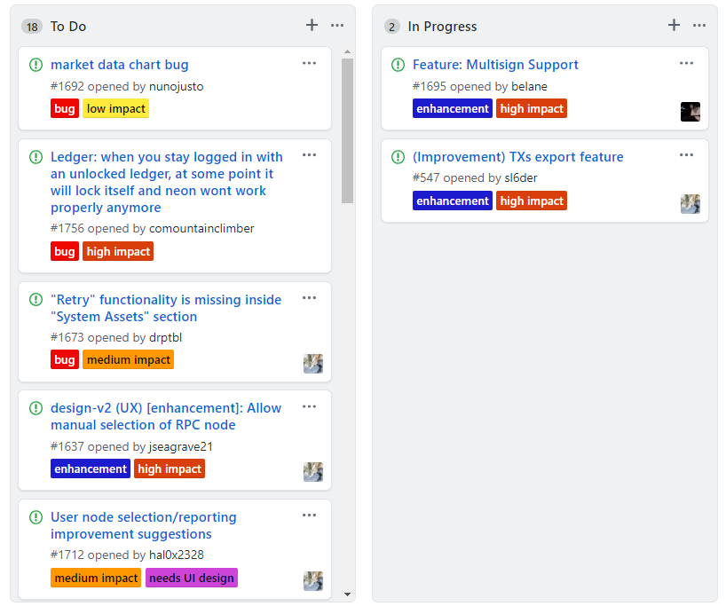

  

# What is CoZ?
CoZ is a global open source blockchain development group that develops tool to enable ecosystem growth. CoZ is a unique open source initiative in that it awards contributions to its various project. Awards are distributed to the development community using a number of mechanisms with the most common being directly associated with a GitHub issue or pull request.
  
 # How to participate:
 
 1. Join the CoZ slack channel [here](https://join.slack.com/t/cityofzion/shared_invite/enQtMjcwOTUxNDc1ODU5LWU5ODBlYjhjMDNmNTE3ZDVhOTMzZDA5ODczMmEyMWNhNTdjOTFlM2Y1ZDVkYjM0NGU0OWFlNGVhOWY3ZTEzZTI)
 
 2. To join development/project focused channels, follow the instructions [here](https://get.slack.help/hc/en-us/articles/205239967-Browse-and-join-channels)
 
 3. Repos which are eligible for awards are listed below
 
 # Our award process
 
 1. Eligible initiatives are listed [here](https://github.com/CityOfZion/standards/blob/master/Introduction.md#initiatives-eligible-for-awards).
 
 2. Each eligible repo has a project board [(example)](https://github.com/CityOfZion/neon-wallet/projects/3) of tasks with impact labels.  The impact label is correlated to both the tasks importance to the project as well as eligible awards for task completion.  You can either directly submit pull requests against the issues or contact the project leads in the Slack channels to be assigned the tasks.
 
 

  

 
 3. When an issue (or award justified PR) is closed out, it is moved to the [Award Distribution Project](https://github.com/orgs/CityOfZion/projects/1).  The project leads provide a comment on the Issue or PR indicating the awards for each contributor to the task in points. The **Award Distribution Project** allows contributors to track the status of the award process.  
 
    **Note:** Awards are made at the discretion of CoZ.  Impact labels are an indicator of approximate awards and do not represent any guarantee.
 
 4. When awards for an issue have been distributed, the txid is posted on the GitHub issue or PR.  This creates a fully transparent, closed loop process for contributors and the community. [(example)](https://github.com/CityOfZion/neon-wallet/issues/1741)  
 
   **Note:** If CoZ has not cached your address, we will reach out to acquire it.  At any time you may change your award address by contacting the leadership team.
 
 
# Initiatives Eligible for Awards
The following initiatives are eligible for awards.  Eligible projects are subject to changed based on community needs.
* [Neon Wallet](https://github.com/CityOfZion/neon-wallet)
* [Neon-js](https://github.com/CityOfZion/neon-js)
* [Neo-python](https://github.com/CityOfZion/neo-python)
* [Neo-boa](https://github.com/CityOfZion/neo-boa)
* [Neo-scan](https://github.com/CityOfZion/neo-scan)
* [Neo-go](https://github.com/CityOfZion/neo-go)
* [Neo-storm](https://github.com/CityOfZion/neo-storm)
* [Neo-debugger-tools](https://github.com/CityOfZion/neo-debugger-tools)

