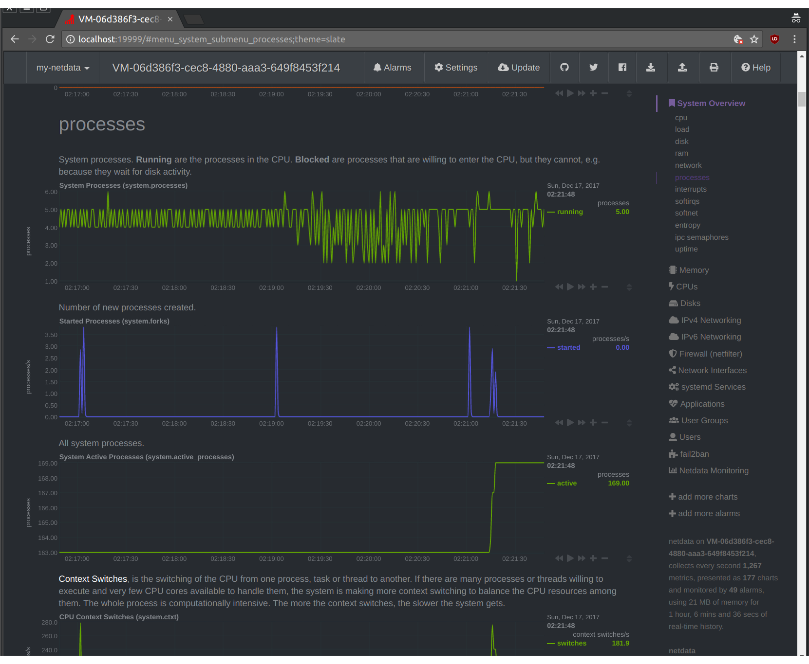

## Recommended setup for consensus nodes

#### Remote access
Remote access to machines should be restricted to SSH using public-key with physical Yubico 4/NEO keys.

#### Hardware
Nodes should not be run in shared machines for security concerns.
Prefered form is to run the nodes with colocation in high security datacenters like Deltalis, Equinix and A1 Arsenal. The hardware configurations for the IaaS providers below can serve as a guideline of expectations for 2018.

Since consensus nodes are the ones computing the network hardware requirements need to be reviewed periodically to guarantee that performance is optimal.

If colocation is not possible the recommended IaaS providers and **minimum** configurations are listed bellow:

- [OVH EG-32](https://www.ovh.com/us/dedicated-servers/infra/1801eg02.xml)
  - CPU: Intel  Xeon E3-1270v6 - 4c/8t - 3.8GHz
  - RAM: 32GB DDR4 ECC 2133 MHz
  - SSD: softraid-1 2x450GB NVMe
  - NET: 1 Gbps
 
- [Packet Workhorse](https://www.packet.net/bare-metal/servers/type-1/)
  - CPU: Intel® Xeon E3-1240v5 - 4c/8t - 3.5GHz
  - RAM: 32 GB DDR3 ECC 1333 MHz
  - SSD: softraid-1 2x120GB Enterprise SSD
  - NET: 2 x 1 Gbps Bonded
 
- [Liquidweb](https://cart.liquidweb.com/configure/single-processor-1275v6)
  - CPU: Intel Xeon E3-1275v6 - 4c/8t - 3.8GHz
  - RAM: 32 GB DDR4 ECC
  - SSD: softraid-1 2x240GB Enterprise SSD
  - NET: 1 Gbps
 
#### Passwords
Use a password manager to hold every password on this setup (Lastpass and Dashlane are recommended). All services should be setup with 2FA enabled and with physical keys when the option is available.

All passwords should be considered strong (use this [lastpass solution](https://lastpass.com/generatepassword.php)).

## SSH authentication keys
Restricting SSH login to public keys make it as good as the keys protection, se we require the use of a physical OpenPGP SmartCard for SSH authentication. We recommend Yubikey 4.
For more about the abilities of PGP on Yubikey refer to [official documentation](https://developers.yubico.com/PGP/).

 - Full [Windows guide](https://developers.yubico.com/PGP/SSH_authentication/Windows.html)
 - Full [Linux/MacOS](https://github.com/drduh/YubiKey-Guide)

Change the defaults Admin PIN from `12345678` and PIN from `123456` to secure memorized combinations.

After add to your key to the SmartCard enabled authentication agent, gpg-agent comes bundled in gpg2 - we recommend that.

## Service provider specific configuration:

On the provider firewall (outside OS settings) setup for block all and add exceptions to ports 22, 20333 and 10333 only.
If other services share the account please be sure to place the nodes in an anti-affinity group.
 
## Linux server configuration
 
Every node needs 2 managers, located in different jurisdictions. Each should have a dedicated user able to login into the system and a third consensus user (not acessible by SSH) should be the only with access to the private keys for the consensus node (careful with the Ubuntu version, this guide uses 16.04 LTS).

on first login give a strong password to root, you will only need this if sudo password is lost (or to revoke those):
```shell
su (sudo su on Ubuntu)
passwd
```

### While still in su

update packages, Ubuntu:

```shell
apt-get update
apt-get upgrade
```

CentOS:

```shell
yum update
```

add manager users (repeat for both managers):

```shell
useradd canesin
mkdir /home/canesin
mkdir /home/canesin/.ssh
chmod 700 /home/canesin/.ssh
```

This guide is based on bash so set that as preferred shell for the manager

```shell
usermod -s /bin/bash canesin
```

Copy the public key of Yubikey public key from `ssh-add -L` of managers into authorized_keys

```shell
vim /home/canesin/.ssh/authorized_keys
```

Setup permissions:

```shell
chmod 400 /home/canesin/.ssh/authorized_keys
chown canesin:canesin /home/canesin -R
```

setup a password for managers (this will be sudo passwords)

```shell
passwd canesin
```

Now we will setup sudo for managers, add `%sudo` goupd and comment with `#` any other group that is not `root`.

```shell
visudo
```

The file should look like:

```shell
# This file MUST be edited with the 'visudo' command as root.
#
# Please consider adding local content in /etc/sudoers.d/ instead of
# directly modifying this file.
#
# See the man page for details on how to write a sudoers file.
#
Defaults        env_reset
Defaults        mail_badpass
Defaults        secure_path="/usr/local/sbin:/usr/local/bin:/usr/sbin:/usr/bin:/sbin:/bin:/snap/bin"

# Host alias specification

# User alias specification

# Cmnd alias specification

# User privilege specification
root    ALL=(ALL:ALL) ALL

# Members of the admin group may gain root privileges
#%admin ALL=(ALL) ALL

# Allow members of group sudo to execute any command
%sudo   ALL=(ALL:ALL) ALL

# See sudoers(5) for more information on "#include" directives:

#includedir /etc/sudoers.d
```

add managers to sudo group

```shell
usermod -aG sudo canesin
```

you will need to login and logout from manager account to update it

```shell
su -l canesin
exit
```

Back as su now lock SSH loging to public key and managers only


```shell
vim /etc/ssh/sshd_config
```

This lines should be added/modified, add all managers separated by space in AllowUsers

```shell
X11Forwarding no
PermitRootLogin no
PasswordAuthentication no
AllowUsers canesin
LoginGraceTime 30
AllowTcpForwarding no
TCPKeepAlive no
AllowAgentForwarding no
DebianBanner no
Banner /etc/ssh/sshd-banner
```

Setup a legal banner for SSH:

```shell
echo "WARNING:  Unauthorized access to this system is forbidden and will be
prosecuted by law. By accessing this system, you agree that your actions
may be monitored if unauthorized usage is suspected." >> /etc/ssh/sshd-banner
```

Add user to run consensus node

```shell
useradd consensus
mkdir /home/consensus
chown consensus:consensus /home/consensus -R
```

Create a very strong password for consensus, this should be shared in a secure way between managers
```shell
passwd consensus
```

Last step as su is to reboot ssh, after that login back as a manager.

```shell
sudo systemctl restart sshd.service
```

### While logged as manager

#### Firewall

First thing is to install firewall and lockdown the node, on Debian (Ubuntu):

```shell
sudo apt-get install ufw
```

On CentOS:

```shell
sudo yum install epel-release
sudo yum install ufw
```

Set IPV6 to yes in `vim /etc/default/ufw` and allow only the ports used:

```shell
sudo ufw default deny incoming
sudo ufw allow ssh
sudo ufw allow 10333
sudo ufw allow 20333
sudo ufw disable
sudo ufw enable
```

#### Automatic security updates

##### On Ubuntu:

```shell
sudo apt-get install unattended-upgrades
sudo vim /etc/apt/apt.conf.d/10periodic
```

update to match:

```shell
APT::Periodic::Update-Package-Lists "1";
APT::Periodic::Download-Upgradeable-Packages "1";
APT::Periodic::AutocleanInterval "7";
APT::Periodic::Unattended-Upgrade "1";
```

Now disable non security automatic updates

```shell
sudo vim /etc/apt/apt.conf.d/50unattended-upgrades
```

update so that the only uncommented lines are:

```shell
Unattended-Upgrade::Allowed-Origins {   
    "${distro_id}:${distro_codename}";
    "${distro_id}:${distro_codename}-security";        
    "${distro_id}ESM:${distro_codename}";
};
```

##### On CentOS:

Install yum-cron and enable it for security packages

```shell
sudo yum -y install yum-cron
sudo systemctl start yum-cron
sudo systemctl enable yum-cron
sudo nano /etc/yum/yum-cron.conf
```

Now change it to match:

```shell
update_cmd = security
apply_updates = yes
emit_via = email
email_to = YOUR_EMAIL_TO_RECEIVE_UPDATE_NOTIFICATIONS
```

on email_to insert the email you want to be warned when updates occur.

#### fail2ban

Now we will install fail2ban, a tool that ban IPs in iptables that have suspicious behaviour. It has good defaults, so just installing is enough. On Ubuntu:

```shell
sudo apt-get install fail2ban
```

On CentOS:

```shell
sudo yum install fail2ban
```

#### 2 Factor Authentication

2FA combined with physical OpenPGP keys for SSH makes for a very strong auth setup. On Ubuntu install it using:

```shell
sudo apt-get install libpam-google-authenticator
```

On CentOS (with epel enabled - see above):

```shell
sudo yum install google-authenticator
```

After installing follow the instructions when running the command as manager, (anwser as y/y/y/n/y), do this as both managers first, as we will update PAM to require the 2FA after this step

```shell
google-authenticator
```

Now edit the SSH configuration to require the 2FA setup:

```shell
sudo vim /etc/pam.d/sshd
```

Add the following line at the end of the file

```shell
auth required pam_google_authenticator.so
```

Comment out the line about password prompt, on Ubuntu:

```shell
# Standard Un*x authentication.
#@include common-auth
```

on CentOS:

```shell
#auth       substack     password-auth
```

Edit the sshd_config file to require the 2FA challenge

```shell
sudo vim /etc/ssh/sshd_config
```

Edit file to allow challange and add line with auth methods:

```shell
ChallengeResponseAuthentication yes
AuthenticationMethods publickey,password publickey,keyboard-interactive
```

now restart SSHD service

```shell
sudo systemctl restart sshd.service
```

Without closing your current SSH session open another window and try to login to confirm that the setup is working correctly.

#### Monitoring

Monitoring a consensus node is very important to spot issues and help improve the NEO project. We will install netdata and access it only by a SSH tunnel (we keep the firewall blocking setup).

Install the pre-built static version (to reduce attack surface and not have unneeded dependencies):

```shell
bash <(curl -Ss https://my-netdata.io/kickstart-static64.sh)
```

To access the create a SHH tunnel and open a browser to localhost:19999

```shell
ssh -f canesin@SERVERIP -L 19999:SERVERIP:19999 -N
```



#### Send a email on every successful login

```shell
sudo apt-get install mailutils
```

on CentOS:

```shell
sudo yum install mailx
```

Edit the default bash profile:

```shell
sudo vim /etc/profile
```

Add the following lines at the end of the file, edit with your email to receive login notifications:
```shell
SIP="$(echo $SSH_CONNECTION | cut -d " " -f 1)"
SHOSTNAME=$(hostname)
SNOW=$(date +"%e %b %Y, %a %r")
echo 'Someone from '$SIP' logged into '$SHOSTNAME' on '$SNOW'.' | mail -s 'SSH Login Notification' 'YOUR@EMAIL.HERE'
```

#### Logwatch

Configure logwatch to send you a daily summary of the actions on the node (that should be none usally), on Ubuntu:

```shell
sudo apt-get install logwatch
```

on CentOS:

```shell
sudo yum install logwatch
```

Add now a cron job to send your your email the summary:

```shell
sudo vim /etc/cron.daily/00logwatch
```

change the default execution to:

```shell
/usr/sbin/logwatch --output mail --mailto YOUR@EMAIL.HERE --detail high
```

#### Blacklist USB and Firewire storage

We will reduce attack surface by blacklisting unneeded modules, normally WiFi and Bluetooth are already off (verify!) server kernels so we need to disable only USB storage.

```shell
sudo vi /etc/modprobe.d/blacklist.conf
```

Add the lines:

```shell
blacklist usb-storage
blacklist firewire-core
```

#### Install and run consensus node

Install pre-requisites, on Ubuntu:
```shell
sudo apt-get install unzip sqlite3 libsqlite3-dev libleveldb-dev libunwind-dev
```

on CentOS:
```shell
sudo yum install unzip leveldb-devel libunwind-devel
```

login as the consensus user:

```shell
su consensus
cd ~
```

download, verify the checksum and unzip the latests neo-cli client for your distro:

```shell
wget https://github.com/neo-project/neo-cli/releases/download/v2.5.2/neo-cli-YOURDISTRIBUTION.zip
sha256sum neo-cli-YOURDISTRIBUTION.zip
unzip neo-cli-YOURDISTRIBUTION.zip
cd neo-cli
chmod u+x neo-cli
```

Now copy the setup you are running the node for (testnet or mainnet):

```shell
mv protocol.json protocol.json.back
cp protocol.testnet.json protocol.json
```

If this is the first time you will need to create a wallet for consensus.

```shell
./neo-cli
neo> create wallet /home/consensus/cn_wallet.json
password: SOMESTRONGPASSWORD
password: SOMESTRONGPASSWORD
```

Now copy the start_consensus script 

```shell
cd ~
wget https://raw.githubusercontent.com/CityOfZion/standards/master/assets/nodes/start_consensus.sh
chmod u+x start_consensus.sh
```

Edit the contents to match your wallet file location and password.
Now let's run it under control of supervisord, on Ubuntu:

```shell
sudo apt-get install supervisor
```

on CentOS:

```shell
sudo yum install supervisor
```

Now configure supervisord to execute start_consensus (edit the file if needed):

```shell
wget https://raw.githubusercontent.com/CityOfZion/standards/master/assets/nodes/supervisord.conf
chmod 700 supervisord.conf
cp supervisord.conf /etc/supervisord.conf
sudo supervisord
```

To make supervisord run automatically on system restart you need to add its [init script](https://github.com/Supervisor/initscripts).

That is all, now logout from the server and only login if any update must be deployed or ill-behaviour is detected.
